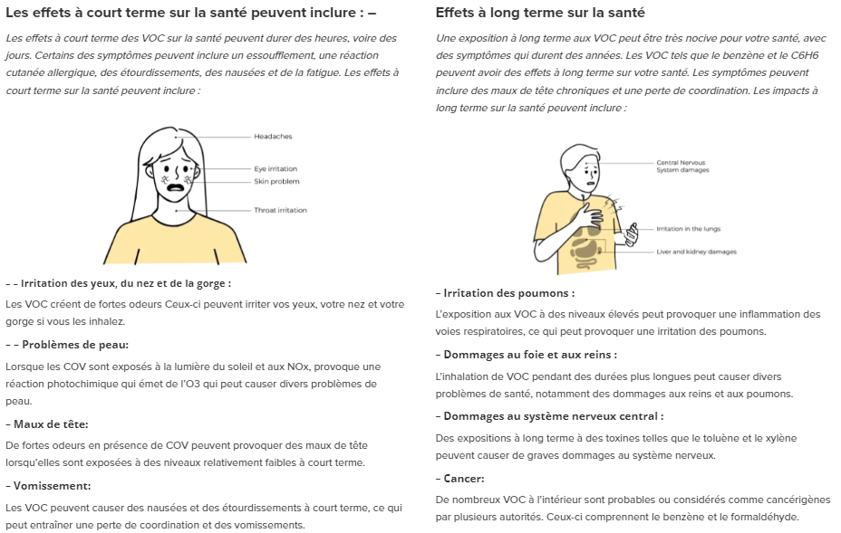
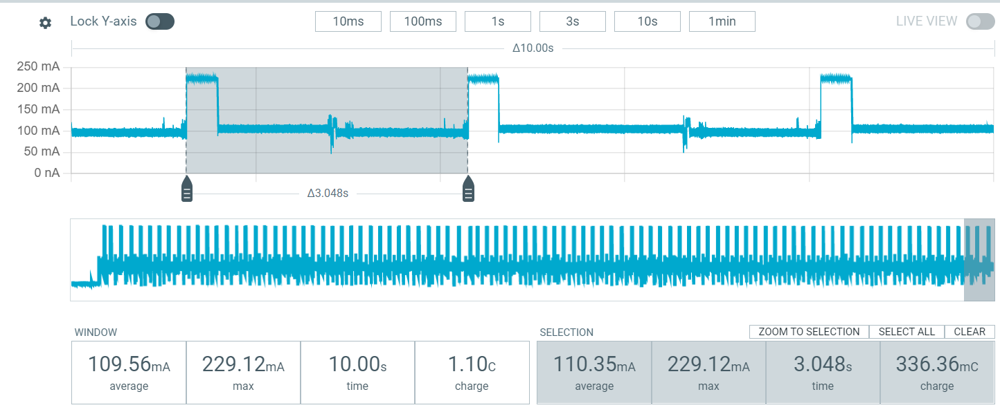
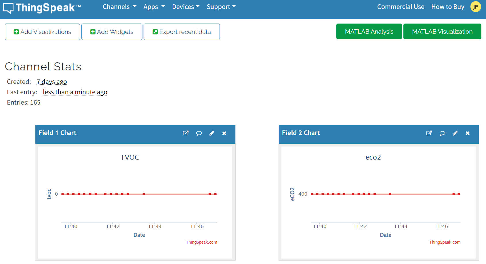

# air-quality-low-power-project

> The aim of this project : 
- To propose LoRa (Long range) communication between two Heltec WiFi LoRa cards (ESP32) 
- Measure the current consumption (mA) of this type of communication
- Use the ThinkSpeak tool to visualise the data collected 
- Use different sensors and evaluate them 

 
We decided to use a sensor that measures air quality: the SGP30.
 
*About the sensor :*  
-  Provides accurate monitoring of indoor air quality by detecting VOCs and hydrogen
- I2C communication 
- Provides total VOC (TVOC) and carbon dioxide equivalent (eCO2) readings
- Measurement ranges: 
   - TVOC: 0 to 60000 ppb (parts per billion)
   - CO2: 400 to 60,000 ppm (parts per million)
 
 
  
*Why we wanted to monitor air quality :*

*What we want to monitor* : 
- Staying in top condition of air quality 

- Keeping current consumption consistent on our cards: 
**Here are our readings :** 

- Visualise this using the ThinkSpeak tool:  

